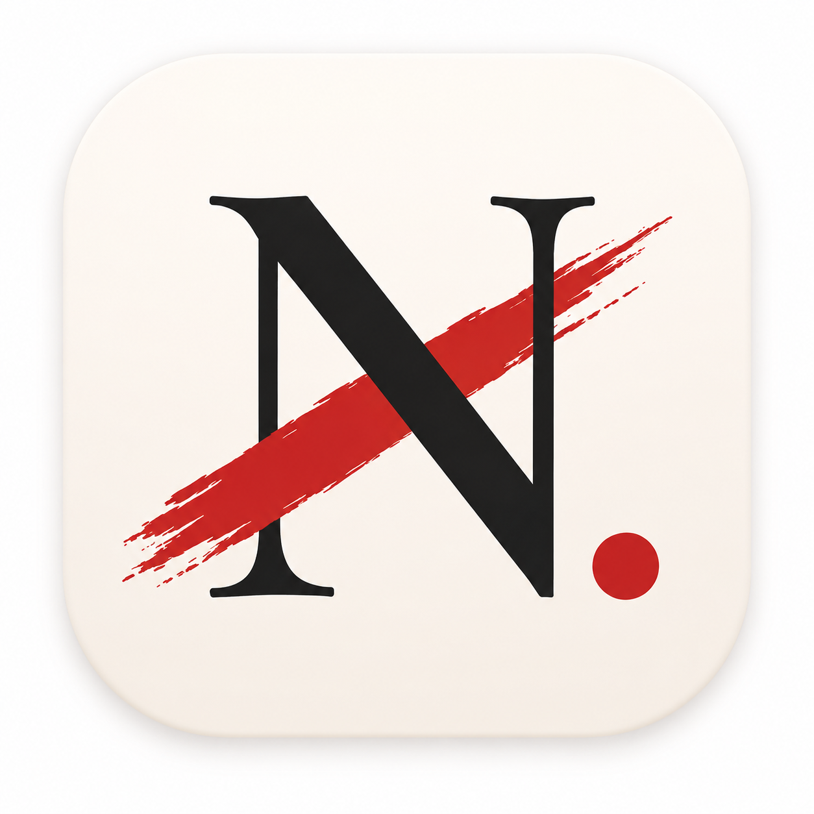

# NotToday

<p align="center">
  
</p>

<p align="center">
  <strong>A desktop-first floating task manager for Windows.</strong>
</p>

<p align="center">
  
  
  
  
  
</p>

NotToday 是一个面向 Windows 桌面的轻量任务管理应用。它的核心目标很简单：用一个安静、常驻、可快速唤起的浮动窗口，记录今天、过去和未来要做的事，然后专注把它们完成。

当前版本专注于本地体验，不包含云同步。所有任务数据保存在本机 SQLite 数据库中。

## Preview

<p align="center">
  
</p>

## Features

- Floating desktop window built for quick capture
- Add tasks with title, date, time, priority, and optional reminder
- Group tasks into Past, Today, and Future sections
- Sort tasks by priority first, then by scheduled time
- Mark tasks as completed and record `completed_at`
- Hide completed tasks that were not completed today
- Edit task title, date, time, priority, and reminder
- Delete tasks with confirmation
- Local SQLite persistence
- Windows tray icon and taskbar icon
- Window state persistence
- Optional auto-start support

## Tech Stack

| Layer | Tech |
| --- | --- |
| Desktop shell | Tauri 2 |
| UI | React 19 |
| Language | TypeScript |
| Styling | Tailwind CSS |
| Storage | SQLite via `@tauri-apps/plugin-sql` |
| Icons | Lucide React |
| Package manager | pnpm |

## Project Structure

```text
NotToday/
+-- src/
|   +-- components/        # React UI components
|   +-- settings/          # App settings hooks
|   +-- tasks/             # Task domain model, reducer, repository, reminders
|   +-- App.tsx
|   +-- main.tsx
+-- src-tauri/
|   +-- src/               # Tauri/Rust application shell
|   +-- icons/             # App, tray, taskbar, and bundle icons
|   +-- tauri.conf.json
+-- package.json
+-- README.md
```

## Getting Started

Install dependencies:

```bash
pnpm install
```

Start the Tauri development app with hot reload:

```bash
pnpm tauri dev
```

Run type checking:

```bash
pnpm check
```

Run tests:

```bash
pnpm test
```

Build the frontend only:

```bash
pnpm build
```

Package the Windows desktop app:

```bash
pnpm tauri build
```

The release executable is generated under:

```text
src-tauri/target/release/
```

## Development Notes

- `pnpm tauri dev` starts Vite on `http://localhost:1420` and loads it inside the Tauri WebView.
- Regular React, TypeScript, CSS, and asset changes support hot reload during development.
- Rust, Tauri configuration, icon, and migration changes may require restarting the dev process.
- SQLite migrations are registered in `src-tauri/src/lib.rs`.
- Task persistence logic lives in `src/tasks/taskRepository.ts`.

## Roadmap

- Calendar view
- Richer statistics
- Habit tracking
- More reminder options
- Better task history and completion insights
- Cross-platform support after the Windows MVP is stable

## Status

NotToday is currently in the Desktop MVP phase. The product direction is intentionally narrow: keep the capture flow fast, keep the window lightweight, and keep the data local.
